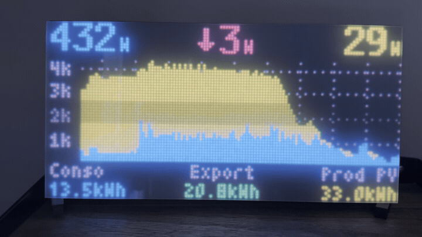
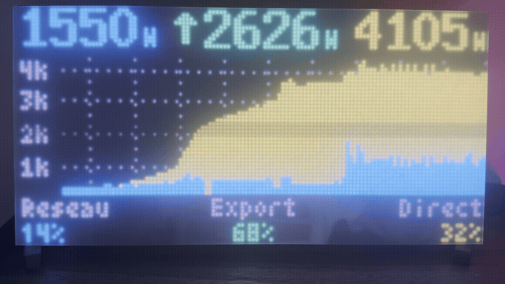

# RGB Matrix Energy Dashboard



A 128x64 RGB LED matrix dashboard for home energy monitoring, inspired by
[OpenEnergyMonitor](https://openenergymonitor.org/). It reads a single JSON
MQTT topic (`energy/home`, see [MQTT payload](#mqtt-payload-expected)) and
renders:

- **Top row**: instant **house use / grid / PV** in watts. The grid value in
  the centre carries a direction arrow: **down + red = import**,
  **up + green = export**. The `W` unit is rendered in a smaller font so the
  digits keep their full size and the value stays readable.
- **Middle**: stacked history chart (yellow = PV production,
  blue = house load excluding battery)
- **Bottom**: cycles every 5 s between two pages:
  - **Battery overview** — a vertical battery icon (white frame, fill **green
    > 20 % / red below**, `+` terminal on top, level proportional to SOC) with
    the SOC %, the **signed battery power** in the centre (discharge ↑ red,
    charge ↓ green, `0W` shown without an arrow), and the **cumulative input
    kWh** on the right.
  - **Daily energy** — Conso / Export / Prod PV, each shown as **rounded kWh
    + matching ratio %** (Reseau / Export / Direct), computed as the delta of
    the cumulative kWh counters since midnight.
- **Night mode**: an optional MQTT ON/OFF topic can blank the panel (great to
  kill the glow at night) while MQTT, history and daily totals keep running in
  the background. A short heartbeat on the four corners shows the panel is
  still alive: **green** when the network is up, **red** (and faster) when it
  isn't.

Built for the Raspberry Pi Zero 2W with the
[Adafruit RGB Matrix HAT (PWM)](https://www.adafruit.com/product/2345).
The panel I used was sold as a single 128x64 unit — internally it may well
be two 64x64 tiles chained, but it was already wired and presented as one
128x64 module. Yours may have a different physical layout, in which case the
`display.hardware_mapping`, `cols`, `rows`, `chain_length` and `parallel`
values will need to be adjusted.

**Strongly recommended before running this project**: get the
[hzeller rpi-rgb-led-matrix](https://github.com/hzeller/rpi-rgb-led-matrix)
sample programs working first (e.g. `demo`, `runtext`, `image-viewer`). Once
those render correctly on your hardware you will know the exact options to
plug into the YAML config here.

Optionally adapts the matrix brightness from ambient light, either from a
local **Pimoroni LTR-559** sensor on the I2C bus, or from a lux value pushed
over MQTT (handy when the sensor lives on another device).

## Hardware

- Raspberry Pi (tested on Pi Zero 2W)
- Adafruit RGB Matrix HAT (PWM hack soldered for flicker-free output)
- Two 64x64 RGB LED panels chained for 128x64 total
- (Optional) Pimoroni LTR-559 light sensor on I2C bus 1, address `0x23`
- 5V / 4A+ power supply for the panels

## Software prerequisites

### 1. Build and install the RGB matrix library

This project drives the panels through
[hzeller/rpi-rgb-led-matrix](https://github.com/hzeller/rpi-rgb-led-matrix).
You need to build that library **and** install its Python bindings into the
same Python environment you will run the dashboard from. Build deps first:

```bash
sudo apt install -y python3-dev python3-pip python3-venv build-essential \
                    libgraphicsmagick++-dev libwebp-dev cython3
```

### 2. Create a Python virtualenv

The dashboard's shebang is hardcoded to `/home/pi/rgbenv` for convenience:

```bash
#!/home/pi/rgbenv/bin/python3
```

If you want a different venv path, **edit the first line of
`energy_dashboard.py` accordingly**, or run the script through your venv's
Python explicitly. Then create the venv (use `--system-site-packages` so that
optional system packages like `smbus2` are visible):

```bash
python3 -m venv ~/rgbenv --system-site-packages
~/rgbenv/bin/pip install --upgrade pip wheel
```

### 3. Compile the Python bindings into the venv

```bash
git clone https://github.com/hzeller/rpi-rgb-led-matrix.git
cd rpi-rgb-led-matrix
make build-python PYTHON=$HOME/rgbenv/bin/python3
sudo make install-python PYTHON=$HOME/rgbenv/bin/python3
```

Sanity check:

```bash
~/rgbenv/bin/python3 -c "from rgbmatrix import RGBMatrix; print('ok')"
```

### 4. Install the dashboard's Python dependencies

```bash
~/rgbenv/bin/pip install paho-mqtt pyyaml Pillow ltr559
```

(`ltr559` is only needed if you use the Pimoroni ambient brightness sensor.)

### 5. Enable I2C (only for the LTR-559 light sensor)

Uncomment `dtparam=i2c_arm=on` in `/boot/firmware/config.txt` (or
`/boot/config.txt` on older releases), then reboot. `sudo apt install
i2c-tools` lets you check the bus with `i2cdetect -y 1` — the LTR-559 should
appear at address `0x23`.

### 6. An MQTT broker

You need a broker publishing the two JSON topics described below.

## MQTT payloads expected

The dashboard subscribes to **two** JSON topics, both configurable in
`mqtt.topics.*`:

### `energy/home` — live power + daily energy

Carries the live power values, the chart history and the daily energy totals.
Each message is a JSON object with these fields:

```json
{
  "prod_watt": 19,
  "use_watt_no_bat": 347.2,
  "grid_watt": -5,
  "prod_kwh": 71.97,
  "use_kwh_no_bat": 18.83,
  "grid_export_kwh": 4235.818
}
```

| Field             | Unit | Meaning                                   | Where it shows |
|-------------------|------|-------------------------------------------|----------------|
| `prod_watt`       | W    | Instant PV production                      | Top right (yellow) + chart (yellow) |
| `use_watt_no_bat` | W    | Instant house load **excluding battery**  | Top left (cyan) + chart (blue) |
| `grid_watt`       | W    | Instant grid power, **signed**: `>= 0` = import, `< 0` = export | Top centre (arrow + colour: down/red import, up/green export) |
| `prod_kwh`        | kWh  | Cumulative PV production counter           | Daily **Prod PV** (delta since midnight) |
| `use_kwh_no_bat`  | kWh  | Cumulative house consumption counter (excl. battery) | Daily **Conso** (delta since midnight) |
| `grid_export_kwh` | kWh  | Cumulative grid export counter            | Daily **Export** (delta since midnight) |

> The `*_kwh` fields are **lifetime/incremental counters that are never reset
> at midnight**. The dashboard stores the value seen at the start of each day
> (persisted in the DB) and shows `current - midnight baseline` as "today".
> The matching ratios (Reseau / Export / Direct %) shown next to the daily kWh
> are derived from those three daily deltas.

### `energy/ecoflow/batteries/aggregate` — battery overview

Used on the battery overview page (the other half of the bottom 5 s cycle).
Typical EcoFlow aggregate payload:

```json
{
  "batt": 84.8,
  "power_watt": -120,
  "input_kwh": 13.81
}
```

| Field        | Unit | Meaning                                                     | Where it shows |
|--------------|------|-------------------------------------------------------------|----------------|
| `batt`       | %    | Battery state of charge                                     | Left (battery icon fill level + numeric SOC %) |
| `power_watt` | W    | **Signed** battery flow: `> 0` = discharge (red ↑), `< 0` = charge (green ↓), `0` shows the value without an arrow | Centre |
| `input_kwh`  | kWh  | Cumulative charged counter (lifetime, displayed as-is, rounded) | Right (rounded int + small `kWh`) |

### Optional: `display_power` — night mode ON/OFF

If `mqtt.topics.display_power` is set, the dashboard subscribes to that topic
and expects a **plain-text** payload (`ON` or `OFF`, case-insensitive — the
[Tasmota `stat/<device>/POWERx` convention](https://tasmota.github.io/docs/MQTT/#status-outputs)
works out of the box):

| Payload | Effect |
|---------|--------|
| `ON`    | Normal rendering. |
| `OFF`   | Panel is blanked. MQTT, history sampling and daily kWh totals keep running in the background. A short heartbeat blinks on the four corners: **green** (`250 ms on / 2 s off`) when the network is up, **red** (`250 ms on / 1 s off`) when it isn't. |

The state is retained by Tasmota, so on reboot the dashboard picks up the last
known ON/OFF value immediately. Leave `mqtt.topics.display_power` unset (or
commented) to keep the panel always on.

Topic names are configurable; see `config_sample.yaml`.

## Feeding the topics from Home Assistant

If your inverter, PV optimizers, Linky teleinfo or smart meter are already
integrated in Home Assistant, you typically don't need any new hardware
plumbing — just assemble the existing HA sensors into the `energy/home` JSON
payload and publish it with one automation.

The battery topic (`energy/ecoflow/batteries/aggregate`) is normally published
directly by the EcoFlow integration on your broker, so no automation is needed
on the HA side. Point `mqtt.topics.battery` in `config.yaml` to whichever topic
your setup actually publishes.

A few conventions help:

- Use `retain: true` so the dashboard sees the last value as soon as it
  connects (no waiting for the next state change).
- Trigger on `state` of every sensor that feeds the payload — HA will fire the
  automation each time any value updates.
- Guard each value with `float(0)` (or an availability template) so a
  transient `unavailable`/`unknown` doesn't poison the published JSON.
- Make sure units match the table above (watts for `*_watt`, kWh for `*_kwh`).
  Normalize inside the template when sources differ (e.g. divide Wh by 1000 to
  send kWh). `grid_watt` must be **signed**: positive when importing, negative
  when exporting.

### Example: publish the combined JSON

This builds the `energy/home` payload from a few sensors (adapt the entity ids
to yours), divides an EcoFlow PowerStream counter from Wh to kWh, and publishes
the whole object:

```yaml
alias: Publish energy/home
description: Assemble the dashboard JSON payload and publish it on MQTT
triggers:
  - trigger: state
    entity_id:
      - sensor.pv_power
      - sensor.house_power_no_battery
      - sensor.grid_power            # signed: + import / - export
      - sensor.pv_energy_total
      - sensor.house_energy_no_battery_total
      - sensor.grid_export_total
actions:
  - action: mqtt.publish
    data:
      evaluate_payload: false
      retain: true
      topic: energy/home
      payload: >
        {
          "prod_watt": {{ states('sensor.pv_power') | float(0) | round(0) }},
          "use_watt_no_bat": {{ states('sensor.house_power_no_battery') | float(0) | round(0) }},
          "grid_watt": {{ states('sensor.grid_power') | float(0) | round(0) }},
          "prod_kwh": {{ states('sensor.pv_energy_total') | float(0) | round(3) }},
          "use_kwh_no_bat": {{ states('sensor.house_energy_no_battery_total') | float(0) | round(3) }},
          "grid_export_kwh": {{ states('sensor.grid_export_total') | float(0) | round(3) }}
        }
mode: single
```

Only these six fields are needed.

## Setup

1. Clone the repo on your Pi:

   ```bash
   git clone https://github.com/<your-user>/rgb-matrix-energy-dashboard.git
   cd rgb-matrix-energy-dashboard
   ```

2. **Copy the sample config and adapt it** (this is the file the dashboard
   actually reads; it is gitignored so your credentials never get committed):

   ```bash
   cp config_sample.yaml config.yaml
   ${EDITOR:-nano} config.yaml
   ```

   At minimum, set:
   - `mqtt.host` / `mqtt.port` / `mqtt.username` / `mqtt.password`
   - `mqtt.topics.*` to match your broker layout
   - `display.fonts.*` to point to PIL bitmap fonts you have locally
     (or use TTF fonts; see comments in the file)

3. (Optional) Plug in the LTR-559 sensor, then verify it answers on the bus:

   ```bash
   sudo apt install i2c-tools
   i2cdetect -y 1     # expect "23" in the grid
   ```

## Running



Manually:

```bash
sudo /home/pi/rgbenv/bin/python3 ./energy_dashboard.py
```

Or pass a custom config path:

```bash
sudo /home/pi/rgbenv/bin/python3 ./energy_dashboard.py /etc/mydash.yaml
```

`sudo` is required because the matrix library needs direct GPIO access.

## Run on boot via systemd

A reference unit file is provided at `energy-dashboard.service`. Install it
and enable autostart:

```bash
sudo cp energy-dashboard.service /etc/systemd/system/
sudo systemctl daemon-reload
sudo systemctl enable --now energy-dashboard.service
```

Then watch the logs:

```bash
sudo journalctl -u energy-dashboard -f
```

## Brightness control

When `brightness.enabled: true`, the matrix brightness ramps between `min`
and `max` as the measured lux moves between `lux_min` and `lux_max`, with
exponential smoothing (`ema_alpha`). Two lux sources are supported.

### Local sensor (`source: sensor`, default)

Uses the Pimoroni LTR-559 on the I2C bus. Because the sensor sits behind
the panel, readings are heavily attenuated: run the dashboard for a day,
watch the `brightness read (sensor)` / brightness values in the logs
(`journalctl -u energy-dashboard -f`), and tune `lux_min` / `lux_max`
accordingly.

### Remote lux over MQTT (`source: mqtt`)

Useful when the LTR-559 (or any other lux source) lives on another device
and its value is already published on your broker. Set:

```yaml
brightness:
  enabled: true
  source: mqtt
  mqtt_topic: sensors/livingroom/lux
  mqtt_json_key: lux         # only used if the payload is JSON
  min: 15
  max: 80
  lux_min: 0.5
  lux_max: 300
  poll_seconds: 1
  ema_alpha: 0.4
```

The payload can be a bare number (`12.3`, `12.3 lx`) or a JSON object
(`{"lux": 12.3}` — the key is `mqtt_json_key`, default `lux`, falling back
to `value`). Until the first lux message arrives the matrix stays at its
static brightness.

## SD card wear

The history database lives **in RAM** (`:memory:` SQLite) at runtime, and is
dumped to the disk file (`history.db`) once per hour and on a clean shutdown
(SIGTERM). Adjust `history.backup_minutes` to trade SD wear for data loss
resilience on a power cut.

## Layout

```
+--------------------------------------------------------------+
|  USEw         v GRIDw                            PVw         |  small 'W'
|--------------------------------------------------------------|
|  3k ··· ······································ ·········    |
|  2k ·····████······························ ··  ········    |  chart
|  1k ·····████··········█·······█··········  ··  ··········  |
|     YYYYYYYYYBBYYYYBBYYYYBBBBBYYYYBBBBYYYY  YY  YYYYBBBB     |
|--------------------------------------------------------------|
|   ▆ 85%       ^ 120W                          14kWh          |  battery page
+--------------------------------------------------------------+
```

The bottom area alternates every 5 s between the **battery page** shown above
and the **daily energy page** below:

```
|   Conso         Export             Prod PV                  |
|   2kWh 45%      0kWh 30%           0kWh 70%                 |
```

## Acknowledgments

The whole idea — the layout, the colour palette and the daily share ratios —
is directly inspired by [emoncms](https://emoncms.org/) and its
**MySolarPVBattery** app, part of the
[OpenEnergyMonitor](https://openenergymonitor.org/) project. Huge thanks to
[@TrystanLea](https://github.com/TrystanLea) for his superb work on emoncms and
the OpenEnergyMonitor ecosystem over the years.

## License

This dashboard is released under the MIT license — see [`LICENSE`](LICENSE).

Note: it drives the panels through
[hzeller/rpi-rgb-led-matrix](https://github.com/hzeller/rpi-rgb-led-matrix),
which is **GPL-2.0-or-later**. The source files here are MIT (and MIT is
GPL-compatible), but the *combined running program* you build with that
library is a derivative work governed by the GPL. The library is installed
separately and is not redistributed by this repository.
